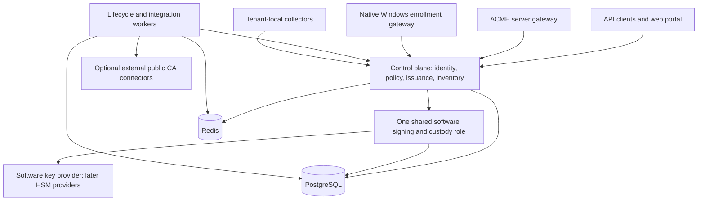

# Architecture

The platform, CA ownership, initial software tier and operating contracts are accepted in [ADRs 0001–0007](decisions/README.md). Exact interfaces, concurrency mechanisms and supported runtime versions still require implementation evidence. No application role is implemented.

## Platform and initial deployment roles

Use Java/Spring Boot, Bouncy Castle and Java cryptographic providers, PostgreSQL, and Redis. Keep most backend implementation in one language. A Windows-side connector may use a different implementation if native interoperability and directory integration justify it.

Begin with a modular codebase and a small number of independently deployable roles. Modules do not automatically require separate network services.

FireCA owns the narrow CA-service core over maintained libraries. Perform the bounded EJBCA comparison before freezing issuance contracts; any ownership change needs a superseding ADR and one authoritative issuance/revocation history. Engine integration and key-provider integration are different boundaries.

The Windows gateway is a required eventual capability, not an implemented endpoint. External public CA connectors obtain certificates rather than exposing FireCA private-CA signing keys.

| Role | Responsibilities |
| --- | --- |
| Control plane | Tenant and identity administration, authorization, profiles, enrollment requests, certificate metadata, inventory, and portal/API |
| Signer/custody | Apply protected key operations for an authorized authority/key version; enforce operation type, approved request binding, and ownership generation |
| Workers | Durable job execution, renewal orchestration, observations, alert evaluation, notifications, and external integrations |
| Protocol gateways | Map ACME and Windows enrollment into the same authorization and issuance contracts |
| Collectors/connectors | Reach customer-local stores, endpoints, and directories; report authenticated observations and perform explicitly authorized integration tasks |

The same role can serve many customers. Authority-to-worker routing is operational allocation; it does not define customer trust. Dedicated roles or provider partitions can later provide stronger isolation.

## Initial trust and privilege boundary

Control-plane authorization, privileged database/platform operators and signer administration are trusted in the initial software tier. Separate processes and record bindings protect ordinary product paths; they do not establish independent approval against an actor controlling authoritative approvals. HSM non-exportability alone does not change that approval boundary.

| Actor | Product authority | Custody/assurance boundary |
| --- | --- | --- |
| Enrollment principal | Tenant/profile/identifier-scoped CSR and renewal requests | No CA-key material or arbitrary CA signing |
| Tenant policy/CA administrator | Authorized versioned grants/profiles and authority lifecycle/import association | No ordinary CA-key export; verify issuer key/certificate/chain association |
| Control-plane service | Establish authenticated approval and persist immutable request bindings | Trusted authorization component; does not need wrapping material |
| Shared signer | Resolve approved request, current state/grants/generation and constrained key operation | Only role with software CA-key access |
| Workers/gateways | Scoped durable work and protocol translation | No provider credentials or arbitrary CA signing input |
| Observer/validator connector | Explicit targets or namespace/challenge context through separate grants | Cannot substitute another tenant's result or inherit enrollment authority |
| Custody/recovery operator | Named bootstrap, unlock, wrapping rotation and protected transfer procedures | Trusted privileged operator; independent recovery copies required |
| Database/platform administrator | Infrastructure and authoritative store administration | Privileged compromise can alter approval or reach software custody |

Audit writes are append-only for ordinary application roles and exported when a separately administered destination is required. Local audit metadata alone does not prove resistance to a privileged database operator.

## PostgreSQL and Redis

PostgreSQL is authoritative for tenants, permissions, authority/key metadata, profiles, requests, certificate records, durable jobs, results, observations, outbox events, and audit metadata. Initial encrypted key payloads and wrapping/provider metadata are stored together in PostgreSQL. Future secret payloads use the same durable model unless a later ADR changes it.

Redis holds caches, temporary sessions, rate-limit counters, worker presence, short-lived coordination leases, and notifications. Redis loss must not discard accepted enrollment work or certificate results.

Persist a job or event before emitting a Redis wakeup. Workers reconcile pending durable work even when notifications are missed. PostgreSQL transactional locking and constraints provide building blocks for authoritative updates. [PostgreSQL locking](https://www.postgresql.org/docs/current/explicit-locking.html)

### Ownership and stale workers

An expiring Redis lease can be lost while its worker is paused. Redis failover can also affect exclusivity. [Redis distributed locking](https://redis.io/docs/latest/develop/clients/patterns/distributed-locks/)

Protected admission and authoritative updates use an ownership generation allocated in PostgreSQL and increasing within the supported database history. Validate tenant/request bindings, authority state and current generation. A stale worker cannot admit a new operation merely because it once held a Redis lease. Restoring an earlier database can erase that history; the counter is not globally monotonic across restores.

Start with one active shared signer and per-authority protected admission/serialization. A check followed by a pause does not guarantee that an admitted provider operation stops after connection loss or suspension. Validate the exact mechanism at admission, provider execution, persistence and release before distributing signing work.

Durable jobs may be delivered more than once. Bind issuance to a tenant-scoped request/idempotency identity, reserve a unique issuer/serial and persist exact canonical to-be-signed bytes before execution. Reconcile the same inputs after ambiguity; select one committed result and release it only after current authorization/state checks. Repeated provider execution is possible. Never expose an uncommitted alternate result or promise exactly-once HSM execution.

Suspension requested blocks new leaf admissions and new leaf-result release; effective/drained requires completion or exclusion of in-flight attempts. Preserve signed-but-withheld history. Existing released certificates are not automatically revoked, and required CRL operations remain separately permitted.

### Takeover and disaster recovery

Uncertain signer/primary replacement requires manual process/node/provider exclusion before replacement signing. A single replica, deleted pod, rotated mount or fresh epoch does not establish exclusion of an old process with an in-memory key.

Restore PostgreSQL, required WAL, encryption metadata and recovery material with signing disabled. Establish complete issuance, revocation, grant and suspension history before resuming each issuer. Unknown/incomplete history leaves it quarantined; never publish an incomplete restored CRL as current complete status. Replacement alone does not invalidate old certificates: a tested parent-revocation or relying-party distrust/blocking procedure is required.

The initial profile uses durable local commits, backups and continuous WAL archiving with manual recovery. Zero-loss disaster recovery is not claimed; a pilot requiring synchronous durability needs the corresponding demonstrated profile. [Signing/recovery contract](decisions/0005-software-signing-and-recovery.md)

## Key custody and providers

Represent a managed key by a stable logical identity plus a version, provider identifier, provider handle, public information, permitted usages, and export policy. The ordinary API must not receive CA private-key bytes.

Keep these permission classes distinct:

- CA signing keys: certificate, subordinate-CA, CRL, and other specifically authorized CA operations.
- Application certificate keys: client-owned, browser-generated, or explicitly custodial.
- Standalone asymmetric/symmetric keys: their own allowed operations and export policy.
- General secrets: versioned encrypted values with read/write permissions.

CA issuance uses approved structured certificate inputs and profiles. An arbitrary-signing API for standalone keys must not accept a CA key as an interchangeable key identifier.

Use maintained authenticated encryption, per-record data keys, versioned deployment wrapping keys and tenant/key/version/purpose binding. Supply wrapping material separately to the signer. Automatic unlock is the ordinary known-safe restart default; manual unlock is an explicit restricted operating mode. Keep two independently secured offline recovery copies with named custodians.

Bootstrap the administrator locally through a single-use setup operation and provision service TLS independently of the production CA. Preserve old wrapping versions until live records and retained backups have a supported recovery path. Demonstrate fresh offline bootstrap, interrupted rotation, copy loss and old-backup recovery before enabling custody.

Separate tenant encryption keys improve access separation but do not create hardware isolation inside a shared software signer. Dedicated signers/HSM partitions are a later stronger-isolation option.

Java's provider APIs and PKCS#11 support are integration building blocks, not a guarantee that every HSM will work identically. Validate mechanisms, key usages, session behavior, and vendor runtime dependencies per provider. [Java PKCS#11 guide](https://docs.oracle.com/en/java/javase/25/security/pkcs11-reference-guide1.html)

## Root and issuer lifecycle

Support an offline root with online issuing authorities. A customer can have FireCA generate an issuing key/CSR and sign that CSR using an existing root outside FireCA; importing the root private key is not required.

Authority records are logical identities. Issuer versions bind a particular CA certificate to its key/provider version. Keep old issuer records and required revocation capabilities available across rollover until the retirement policy allows removal.

Use complete CRLs initially and stable customer-controlled self-hosted publication names with issuer-version paths. Retain old issuer keys, CRL numbers and status history through the latest outstanding certificate expiry plus recorded retention/cache margin. Suspension, rollover, offboarding and maintenance expiry do not silently remove status service.

Choose and test a representative TLS client and configured mTLS verifier. A shared verifier must include authorized trust-domain/issuer context when mapping identities. Record actual revocation refresh/reload, failure behavior and maximum rejection delay; database revocation and publication success do not prove client rejection. [Experimental defaults and trust contract](decisions/0006-enrollment-observation-and-trust.md)

## ACME validation topology

DNS-01 is the first standard challenge. Self-hosted validation uses configured local DNS context and namespace grants; initial hosting may validate publicly reachable challenge records while application endpoints stay private. Hosted private-only DNS requires a scoped outbound tenant validator before offering that mode.

Bind validation work and cached/results to tenant, authority/profile version, account key, order/authorization, identifier, challenge evidence, validation context and expiry. Server policy chooses resolver/connector scope. EAB and challenge success do not replace namespace authorization or final CSR/order identifier matching. Test overlapping private namespaces, stale/replayed results and context substitution.

Additional challenges/wildcards/IP identifiers follow explicit use and routing evidence. Validator and observer transport may be shared with separate permissions and typed operations.

## Native Windows enrollment

Evaluate native XCEP/WSTEP web-service enrollment early against real clients, including authentication, directory identity, template semantics, Group Policy configuration, certificate response formats, and renewal. Native DCOM enrollment is another Windows path; it is not automatically a committed compatibility surface. [Microsoft enrollment methods](https://learn.microsoft.com/en-us/openspecs/windows_protocols/ms-cersod/444f0375-3cf6-4bdf-b41b-18eed3ba6b54)

The selected experiment uses customer-local domain integration, initially one forest and intranet-connected native clients. A Windows-appropriate server connector can handle integrated authentication and directory lookup while FireCA remains the Java backend. No mandatory FireCA endpoint agent.

Require real unattended machine/user Group Policy enrollment and renewal, reboot/logon, permission removal, disable/rename, outage recovery and actual relying-service use. Test strong mapping for relevant domain authentication profiles. Record exact supported builds/authentication/template configuration. DCOM parity and broad AD CS replacement remain deferred. A missing lab leaves the Windows gate unmet without blocking unrelated engineering.

## Inventory and alerting

Track immutable certificates separately from managed certificate purposes and actual deployment observations. A replacement certificate issued successfully may not yet be installed on any endpoint.

Tenant-local collectors can observe internal endpoints and Windows stores for hosted customers. Record the observation source, timestamp, endpoint identity, and observed certificate. Restrict collector scope to authorized customer targets.

Move one registered TLS endpoint observer into the first lifecycle slice, including host/address, protocol, port and SNI. Broader store collectors and discovery follow later. Demonstrate an issued replacement deliberately left undeployed, subsequent fresh replacement observation and stale/unreachable state.

Evaluate alert state from durable records and observation freshness. Notifications are retryable, separately tracked deliveries; they are not the alert record itself.

## Disconnected operation and licensing

The core has no mandatory connection to official hosted FireCA. Bundle locally served assets, images/manifests, required dependencies/tools, notices and verification material; support local identity/notification integrations. Demonstrate network-denied install/restart/upgrade/rebuild/restore for the chosen profile.

Paid self-hosted entitlement permits continued operation of acquired versions; maintenance controls updates/support separately. Verify signed entitlement locally. Maintenance expiry does not stop entitled-version renewal, revocation or recovery. Missing/invalid-file recovery preserves history and authenticated incident/status/export operations. Formal grants remain pending. Hosted cancellation uses a 90-day transition default and funded status retention through outstanding certificate lifetimes. [Continuity decision](decisions/0007-license-and-exit-continuity.md)

Offline trust configuration is explicit and locally managed. External public issuance and other external integrations declare their egress needs; they are not prerequisites for private CA operation.
