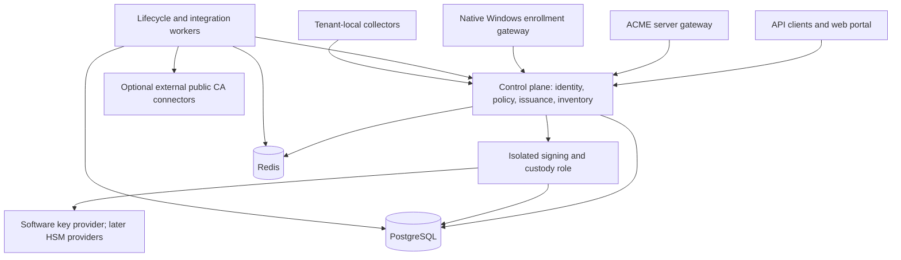

# Architecture

The platform and storage decisions are accepted. The service packaging and internal contracts here are proposed.

## Platform and initial deployment roles

Use Java/Spring Boot, Bouncy Castle and Java cryptographic providers, PostgreSQL, and Redis. Keep most backend implementation in one language. A Windows-side connector may use a different implementation if native interoperability and directory integration justify it.

Begin with a modular codebase and a small number of independently deployable roles. Modules do not automatically require separate network services.

The Windows gateway is a required eventual capability, not an implemented endpoint. External public CA connectors obtain certificates rather than exposing FireCA private-CA signing keys.

| Role | Responsibilities |
| --- | --- |
| Control plane | Tenant and identity administration, authorization, profiles, enrollment requests, certificate metadata, inventory, and portal/API |
| Signer/custody | Apply protected key operations for an authorized authority/key version; enforce operation type, approved request binding, and ownership generation |
| Workers | Durable job execution, renewal orchestration, observations, alert evaluation, notifications, and external integrations |
| Protocol gateways | Map ACME and Windows enrollment into the same authorization and issuance contracts |
| Collectors/connectors | Reach customer-local stores, endpoints, and directories; report authenticated observations and perform explicitly authorized integration tasks |

The same role can serve many customers. Authority-to-worker routing is operational allocation; it does not define customer trust. Dedicated roles or provider partitions can later provide stronger isolation.

## PostgreSQL and Redis

PostgreSQL is authoritative for tenants, permissions, authority/key metadata, profiles, requests, certificate records, durable jobs, results, observations, outbox events, and audit metadata. Encrypted key/secret payloads require durable storage; the physical storage choice remains open.

Redis holds caches, temporary sessions, rate-limit counters, worker presence, short-lived coordination leases, and notifications. Redis loss must not discard accepted enrollment work or certificate results.

Persist a job or event before emitting a Redis wakeup. Workers reconcile pending durable work even when notifications are missed. PostgreSQL transactional locking and constraints provide building blocks for authoritative updates. [PostgreSQL locking](https://www.postgresql.org/docs/current/explicit-locking.html)

### Ownership and stale workers

An expiring Redis lease can be lost while its worker is paused. Redis failover can also affect exclusivity. [Redis distributed locking](https://redis.io/docs/latest/develop/clients/patterns/distributed-locks/)

Protected actions must use a durable, monotonically increasing ownership generation allocated in PostgreSQL. Validate the generation at authoritative updates and at protected signing operations. A stale worker must not gain signing permission merely because it previously held a Redis lease.

Do not implement a generation check followed by an unprotected delayed side effect. The exact signer/claim protocol must account for a pause between checking ownership and using a key. Validate this contract in the foundation milestone before distributing CA work.

Durable jobs may be delivered more than once. Bind issuance to a tenant-scoped request/idempotency identity, reserve a unique issuer/serial combination, persist the intended certificate inputs, and store the completed result. Replays return the recorded result or reconcile an interrupted attempt. Do not claim exactly-once execution of an external HSM operation.

## Key custody and providers

Represent a managed key by a stable logical identity plus a version, provider identifier, provider handle, public information, permitted usages, and export policy. The ordinary API must not receive CA private-key bytes.

Keep these permission classes distinct:

- CA signing keys: certificate, subordinate-CA, CRL, and other specifically authorized CA operations.
- Application certificate keys: client-owned, browser-generated, or explicitly custodial.
- Standalone asymmetric/symmetric keys: their own allowed operations and export policy.
- General secrets: versioned encrypted values with read/write permissions.

CA issuance uses approved structured certificate inputs and profiles. An arbitrary-signing API for standalone keys must not accept a CA key as an interchangeable key identifier.

Use maintained authenticated-encryption implementations and versioned wrapping keys for software custody. Persist tenant/record binding and encryption metadata with encrypted payloads. Define unlock, rotation, backup, restore, retirement, and deletion behavior before custody is enabled.

Separate tenant encryption keys improve access separation but do not create hardware isolation inside a shared software signer. Dedicated signers/HSM partitions are a later stronger-isolation option.

Java's provider APIs and PKCS#11 support are integration building blocks, not a guarantee that every HSM will work identically. Validate mechanisms, key usages, session behavior, and vendor runtime dependencies per provider. [Java PKCS#11 guide](https://docs.oracle.com/en/java/javase/25/security/pkcs11-reference-guide1.html)

## Root and issuer lifecycle

Support an offline root with online issuing authorities. A customer can have FireCA generate an issuing key/CSR and sign that CSR using an existing root outside FireCA; importing the root private key is not required.

Authority records are logical identities. Issuer versions bind a particular CA certificate to its key/provider version. Keep old issuer records and required revocation capabilities available across rollover until the retirement policy allows removal.

Revocation publication must have an explicit freshness/reachability policy. CRL/OCSP mechanisms operate according to the relying clients; a database revocation flag by itself does not enforce rejection on those clients.

## Native Windows enrollment

Evaluate native XCEP/WSTEP web-service enrollment early against real clients, including authentication, directory identity, template semantics, Group Policy configuration, certificate response formats, and renewal. Native DCOM enrollment is another Windows path; it is not automatically a committed compatibility surface. [Microsoft enrollment methods](https://learn.microsoft.com/en-us/openspecs/windows_protocols/ms-cersod/444f0375-3cf6-4bdf-b41b-18eed3ba6b54)

A customer-local Windows connector can support directory/authentication integration if required. Enrollment must remain usable by native Windows clients without a mandatory FireCA endpoint agent. The prototype decides the connector topology; production compatibility is an independently validated milestone.

## Inventory and alerting

Track immutable certificates separately from managed certificate purposes and actual deployment observations. A replacement certificate issued successfully may not yet be installed on any endpoint.

Tenant-local collectors can observe internal endpoints and Windows stores for hosted customers. Record the observation source, timestamp, endpoint identity, and observed certificate. Restrict collector scope to authorized customer targets.

Evaluate alert state from durable records and observation freshness. Notifications are retryable, separately tracked deliveries; they are not the alert record itself.

## Disconnected operation and licensing

The core has no mandatory connection to the official hosted FireCA service. Bundle assets locally, allow local identity/notification integrations, and use locally verifiable signed license files for paid deployments. Formal licensing terms and license-expiry behavior remain to be specified.

Offline trust configuration is explicit and locally managed. External public issuance and other external integrations declare their egress needs; they are not prerequisites for private CA operation.
